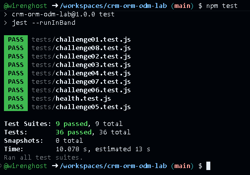

# CRM ORM/ODM Lab

API REST de un CRM básico que combina un ORM (Sequelize + PostgreSQL) y un ODM (Mongoose + MongoDB).

## Stack

- Node.js 22, Express 5, CommonJS
- Sequelize + PostgreSQL 16 (`User`, `Company`, `Contact`)
- Mongoose + MongoDB 7 (`Activity`)
- Jest + Supertest
- GitHub Codespaces, Dev Containers, Docker Compose
- Supervisor (`npm run dev`)

## Arquitectura

```text
GitHub Codespace
│
├── app       Node.js 22  ──┬── Sequelize ──> postgres (PostgreSQL)
│                           └── Mongoose  ──> mongo    (MongoDB)
├── postgres
└── mongo
```

La aplicación se conecta por nombre de servicio (`postgres`, `mongo`). Las credenciales de desarrollo llegan como variables de entorno definidas en `.devcontainer/docker-compose.yml` (ver `.env.example`).

## Iniciar el Codespace

1. En GitHub: **Code → Codespaces → Create codespace on main**.
2. Espera a que se levanten los tres servicios (`app`, `postgres`, `mongo`). `postCreateCommand` ejecuta `npm install`.

## Instalar dependencias

```bash
npm install
```

## Seed y reset

```bash
npm run seed    # inserta datos deterministas (3 users, 4 companies, 8 contacts, 10 activities)
npm run reset   # elimina y recrea tablas/base de datos y vuelve a sembrar
```

## Iniciar la API

```bash
npm start       # node ./bin/www
npm run dev     # supervisor ./bin/www
```

Servidor en el puerto `3000` (variable `PORT`).

## Pruebas

```bash
npm test
```

Cada suite restablece PostgreSQL y MongoDB antes de ejecutarse y cierra las conexiones al terminar.

## Endpoints

| Método | Ruta | Descripción |
|---|---|---|
| GET | `/health` | Health check |
| GET | `/users` | Listar usuarios |
| GET | `/users/:id` | Obtener usuario |
| POST | `/users` | Crear usuario |
| PUT | `/users/:id` | Actualizar usuario |
| DELETE | `/users/:id` | Eliminar usuario |
| GET | `/companies` | Listar compañías (`?industry=`) |
| GET | `/companies/:id` | Obtener compañía |
| POST | `/companies` | Crear compañía |
| PUT | `/companies/:id` | Actualizar compañía |
| DELETE | `/companies/:id` | Eliminar compañía |
| GET | `/contacts` | Listar contactos |
| GET | `/contacts/:id` | Obtener contacto |
| POST | `/contacts` | Crear contacto |
| PUT | `/contacts/:id` | Actualizar contacto |
| DELETE | `/contacts/:id` | Eliminar contacto |
| GET | `/activities` | Listar actividades (`?type=`) |
| GET | `/activities/:id` | Obtener actividad |
| POST | `/activities` | Crear actividad |
| PUT | `/activities/:id` | Actualizar actividad |
| DELETE | `/activities/:id` | Eliminar actividad |

Los errores se devuelven como JSON: `{ "error": "Contact not found" }`.

## Respuestas

**1. Dos motores.**
Activity va bien en MongoDB porque los datos extras pueden ser diferentes para una llamada, un correo o una reunión.

Company y Contact van bien en PostgreSQL porque una compañía puede tener varios contactos. La base de datos mantiene esa relación con `companyId` y evita relacionar contactos con compañías que no existen.

**2. ORM vs ODM.**

Un ORM permite manejar los datos de las tablas usando objetos del código. Aquí usamos Sequelize con PostgreSQL.

Un ODM hace algo parecido, pero con documentos. Aquí usamos Mongoose con MongoDB. La diferencia principal es que el ORM trabaja con tablas de filas y columnas, y el ODM con documentos.

**3. Configuración por variables de entorno.**

Los datos de conexión se definen en `.devcontainer/docker-compose.yml` como variables de entorno. Escribirlos en los archivos `.js` puede exponer las contraseñas y obliga a cambiar el código si cambia la conexión.

La app usa `DB_HOST=postgres` y `MONGODB_URI=mongodb://mongo:27017/crm`. No usa `localhost` porque las bases están en otros contenedores; `localhost` apuntaría al contenedor de la propia app.

**4. Asociaciones.**

En `models/sequelize/index.js`, `Company.hasMany(Contact)` y `Contact.belongsTo(Company)` indican que una compañía puede tener varios contactos.

La llave foránea es `companyId` y está en la tabla de contactos. Indica a qué compañía pertenece cada contacto.

El alias `as: 'contacts'` da nombre a esa relación. Se usa en `include` y hace que los contactos aparezcan en el campo `contacts` de la respuesta.

**5. Eager loading.**

Si primero busco la compañía y después sus contactos, necesito dos consultas. Con `include`, Sequelize trae ambos en una sola consulta.

Para el reto 05 es preferible usar `include` porque evita una consulta extra. Lo usé en `getById`, dentro de `controllers/companies.js`, para devolver la compañía junto con sus contactos.

**6. Instancia vs consulta.**

En `update` de `controllers/contacts.js`, primero busco el contacto y luego uso `contact.update()`. Esto permite responder 404 si no existe y obtener el contacto actualizado para devolverlo.

Usar `Contact.update({...}, { where })` evita la búsqueda previa y permite actualizar uno o varios registros. Por defecto, devuelve un arreglo con la cantidad de registros modificados.

**7. Esquema flexible.**

En `models/mongoose/activity.js`, `metadata` usa el tipo `mongoose.Schema.Types.Mixed`. Esto permite que CALL, EMAIL y MEETING guarden datos extras diferentes, sin tener que definir cada campo de antemano.

La desventaja es que Mongoose no revisa el tipo de cada dato dentro de `metadata`. Así pueden guardarse datos incorrectos que serían más fáciles de detectar si cada campo tuviera un tipo definido.

**8. Sin ref.**

`contactId` y `userId` guardan los IDs de registros que están en PostgreSQL. `ref` y `populate` trabajan con modelos de Mongoose en MongoDB, por eso no pueden traer directamente esos contactos y usuarios.

Si se elimina un usuario en PostgreSQL, sus actividades pueden seguir en MongoDB con un `userId` que ya no existe. La aplicación tendría que revisar esas referencias y decidir qué hacer con ellas.

**9. Documento actualizado.**

Antes de la corrección, `findByIdAndUpdate()` guardaba el cambio, pero devolvía el documento anterior. Esto pasa porque la opción `new` es `false` por defecto.

En `update` de `controllers/activities.js` agregué `new: true` para devolver el documento actualizado. También agregué `runValidators: true` para revisar los cambios según las reglas del esquema.

**10. Pruebas de comportamiento.**

Las pruebas revisan que la API devuelva los datos correctos y el estado esperado, como 200 o 404.

La ventaja es que puedo cambiar cómo está escrito el código sin rehacer las pruebas, mientras la API siga respondiendo igual. Así puedo mejorar el código y comprobar que sigue funcionando.

**11. Repetibilidad.**

En `tests/setup.js`, `beforeAll` conecta PostgreSQL y MongoDB y ejecuta `reset()` para reiniciar las bases y cargar los datos de prueba. Al terminar la suite, `afterAll` cierra las conexiones.

Así cada suite empieza con los mismos datos y no arrastra los cambios de la anterior. Esto ayuda a que `npm test` dé el mismo resultado cada vez.

**12. Mi experiencia**

El reto 08 fue el que más me costó porque la respuesta seguía mostrando los datos anteriores. Jest esperaba `CLOSED` en `metadata`, pero recibía `INTERESTED`.

Revisé `update` en `controllers/activities.js` y agregué `new: true` para devolver el documento actualizado. Al volver a ejecutar la prueba, pasaron los cinco casos.

## Evidencia
